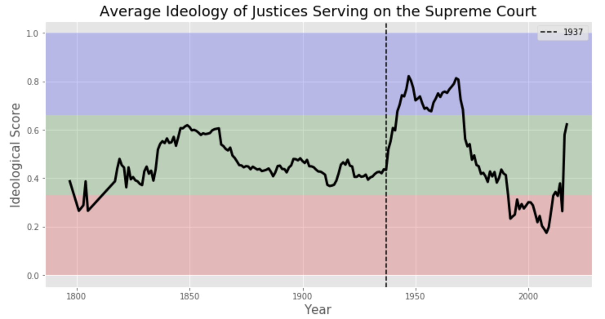
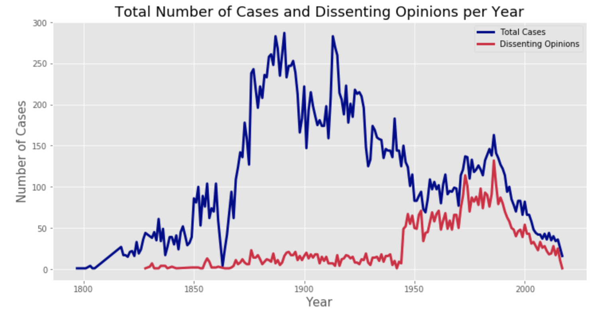
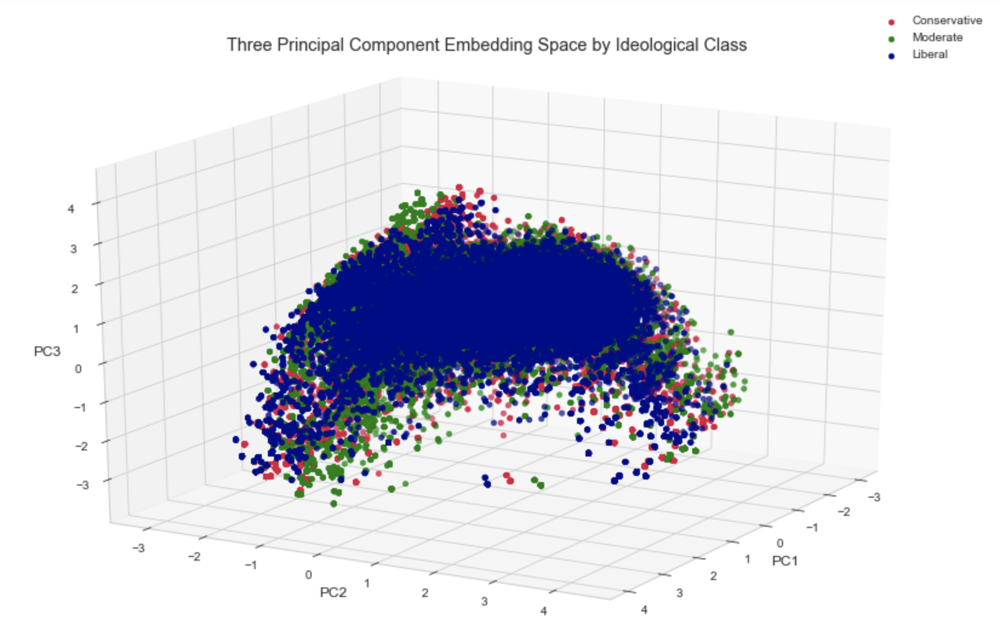
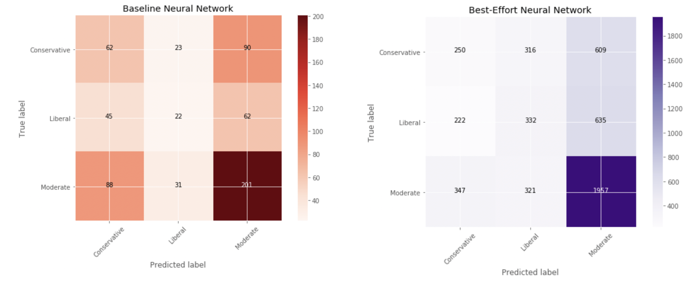

# Classification of Supreme Court Case Opinions by Legal Ideology

## Introduction
The Supreme Court of the United States of America was established in 1789 as the highest federal judiciary. As of 1869, the court is composed of one Chief Justice and eight associate justices. These justices are nominated by the President of the United States and then need to be confirmed by a vote from the Senate in order to serve on the court. Cases brought before the court must pertain to federal/state law or they may concern executive/legislative actions subject to judicial review. Cases are decided by a simple majority of the judicial vote. The Supreme Court will then compose a document known as a "case opinion" explaining what factors lead to the ruling by the justices in the majority vote. A dissenting opinion is usually also composed explaining what factors lead justice's to vote against the majority if the judicial vote is not unanimous.

As cases brought before the Supreme Court are of high importance to the country as a whole and have the ability to affect millions of lives, it is an honor for a legal team to be able to argue a case before the court...and an even bigger honor to have the ruling go in their favor. Thus, it is important for legal teams to know the legal ideologies of the justices presiding over the court in order to construct an argument which appeals to that philosophy. There are multiple ways to classify the legal ideology of a justice, but most rely on interpretations of the justice's written works. Therefore, developing a model to analyze the written work of a justice would allow for a fast, automated, and unbiased method for determining their legal ideology and aid development of arguments for legal teams.

## Legal Ideological Scores
[Segal-Cover Scores](https://en.wikipedia.org/wiki/Segal%E2%80%93Cover_score) are one of the most widely used systems to determine the legal ideology of a person nominated to serve on the Supreme Court. The scores are based on the nominee's previous written work and range from 0 (most conservative) to 1 (most liberal). While this project used Segal-Cover scores to classify a justice as either conservative, moderate, or liberal, these scores were only given to justices beginning in 1937. Thus, the legal ideologies of justices serving prior to 1937 were imputed based on the ideology of the President who nominated them and by the median ideology of the Senate that confirmed their nomination. 

| Ideology | Perspective | Segal-Cover Score |
| :--------: | :-----------: | :------------------: |
| Conservative | The Constitution is a fixed document and its wording is meant to be taken literally | 0 - 0.33 |
| Moderate | Includes aspects of both the Conservative and Liberal ideologies | 0.34 - 0.66 |
| Liberal | The Constitution is a dynamic document and its wording is open to interpretation | 0.67 - 1 |

## Ideology of the Supreme Court Over Time
The legal ideology of a potential justice is an important factor during the nomination process as efforts are usually made to prevent the Supreme Court from leaning too far towards either extreme. However, as people are more likely to nominate and support others of similar beliefs, the average ideology of the Court has changed over time based on which political party held the majority when seats became available. The graph below illustrates these fluctuations in the ideological leaning of the Supreme Court.

It is interesting to note that the Supreme Court remained relatively moderate until roughly 1937, after which its average ideology appears to flip between the extremes. As this has been interpreted as political strategy of Republicans and Democrates alike to influence the leaning of the Court, and thus the interpretation of law for cases brought before the Court, it is not surprising that the frequency of dissenting opinions has also increased. 

_As conservative and liberal ideologies are essentially polar opposites and a justice's term of service on the Supreme Court typically outlasts many executive and legislative terms, a justice nominated by a democratic majority_

_As the graph above suggests, the Supreme Court is becoming more contentious and thus the importance of swing votes is growing._

## Word Vector Embedding
This project utilized word vector embeddings to aid in the differentiation of the verbiage used by each legal ideology. This method transforms each word in a corpus (body of text) into a vector within an embedding space of _n_ dimensionality. The location of each word in the embedding space indicates its semantic relationship with the other words in the space. To put it a different way, the closer a word is to another word in the embedding space, the more similar these two words are semantically. The figure below helps illustrate this concept.

The words present in a random sample of 4,597 case opinions (with equal representation from the three legal ideological classes) were transformed into word vectors with 300 dimensions. The 300 dimensions of the embedding space were reduced to their three principle components and then visualized in the figure below. While the differences between the ideological classes are not distinct, there does appear to be some separation around around the edges. This suggests that the verbiage between the legal ideologies may differ and that these differences might be learned with the appropriate model.

## Recurrent Neural Network
The model created during this project employed bidirectional, recurrent layers within a deep neural network. The bidirectional, recurrent layers were selected as they excel at learning sequences of data, such as text documents. The figure below illustrates how these types of models work. Essentially, the text is presented to a neuron one word at a time. The neuron stores information about the words it has seen to better inform its prediction based on the next word presented to it. The bidirectional component passes the text document through the network layer in both directions, beginning-to-end and end-to-beginning. This allows the model to better learn the context of the words in the text sequences, ultimately leading to increased prediction accuracy.

The baseline model achieved 45% accuracy on the test set and an average F1 score of 0.383, along with strong evidence of overfitting. To improve performance measures and curb overfitting, dropout, early stopping, and L2 regularization was utilized in subsequent itierations of the model. These strategies increased the accuracy to 51% and average F1 score to 0.41. The two confusion matricies below demonstrate the performance improvements between the baseline and final models.

## Conclusion
The recurrent, bidirectional neural network built during this project was able to classify the legal ideology of the case opinion author with 51% accuracy and an F1 score of 0.41. The model displayed strong evidence of overfitting despite multiple interventions and its performance was further hampered by class imbalances. Additional efforts to reduce overfitting and correcting class imbalances may yield performance improvements for the recurrent neural network developed in this project.
